# Active Directory Attack Lab — Kerberoasting to Full Domain Compromise

A hands-on offensive Active Directory lab that walks a full attack chain end to end: from unauthenticated network recon on the LAN to Domain Administrator access on a live Windows Server domain controller. The lab is built across two machines and two CPU architectures — an ARM64 Linux attacker box on Apple Silicon and an x86 Windows Server domain controller — bridged onto the same network.

## Lab Architecture

| Component | Details |
|---|---|
| Attacker host | Apple Mac Mini M4, 32GB RAM — UTM virtualization |
| Attacker VM | Ubuntu Server 26.04 ARM64 — impacket, hashcat, BloodHound CE (`192.168.1.126`) |
| Domain Controller | Windows Server 2022 (VirtualBox on an x86 laptop) — `adlab.lan`, `192.168.1.240` |
| Network | Bridged (192.168.1.0/24) |

## What Was Built

- Windows Server 2022 domain controller, promoted to a new forest (`adlab.lan`) with a static IP and self-hosted DNS
- Deliberately vulnerable domain objects: a Kerberoastable service account (SPN + weak password), an AS-REP roastable user (Kerberos pre-authentication disabled), and an over-privileged service account
- Ubuntu ARM64 attacker box tooled with impacket, hashcat, and BloodHound Community Edition
- A cross-architecture, cross-machine bridged network (ARM64 attacker ↔ x86 domain controller) so the lab mirrors a real internal-network engagement

## Attack Chain

| Stage | Technique | Tooling | MITRE ATT&CK |
|---|---|---|---|
| 1 | Network service discovery | Nmap | T1046 |
| 2 | Kerberoasting | impacket `GetUserSPNs.py` + hashcat (mode 13100) | T1558.003 |
| 3 | AS-REP Roasting | impacket `GetNPUsers.py` + hashcat (mode 18200) | T1558.004 |
| 4 | Offline password cracking | hashcat + rockyou | T1110.002 |
| 5 | Valid-account privilege abuse | Domain Admin service account | T1078.002 |
| 6 | Lateral movement / remote execution | impacket `wmiexec.py` | T1047 |
| 7 | Credential dumping (DCSync) | impacket `secretsdump.py` | T1003.006 |
| 8 | Pass-the-Hash | impacket `wmiexec.py -hashes` | T1550.002 |
| 9 | Attack-path analysis | BloodHound CE | T1069.002 |

---

## Walkthrough

### 1. Reconnaissance

Confirmed reachability to the domain controller across the bridged network, then scanned for the hallmark Active Directory service ports — Kerberos (88), RPC (135), LDAP (389/636), and SMB (445) — all of which identify the host as a domain controller.

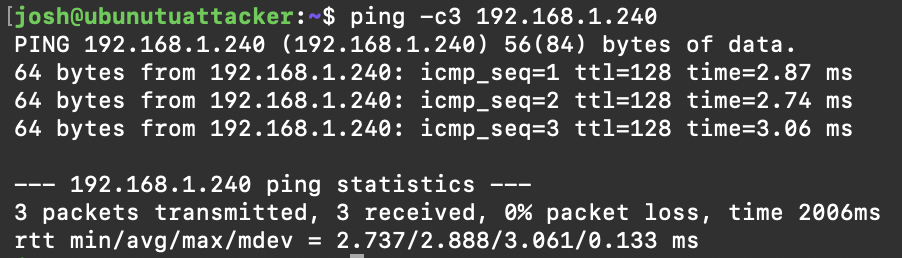

*The attacker box reaches the domain controller — three ICMP replies, with TTL 128 confirming a Windows host.*

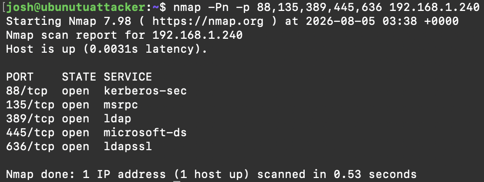

*An `nmap -Pn` scan shows Kerberos (88), RPC (135), LDAP/LDAPS (389/636), and SMB (445) all open — the signature of a domain controller.*

### 2. Lab Environment

The target domain was populated with standard and deliberately vulnerable accounts to create realistic attack paths.

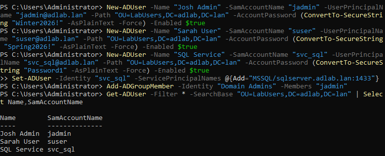

*Creating the domain's standard and intentionally-vulnerable accounts on the DC via PowerShell.*

### 3. Kerberoasting

As an ordinary domain user, requested the Kerberos service ticket for the `svc_sql` account (which exposes a Service Principal Name), then cracked the ticket offline to recover its plaintext password.

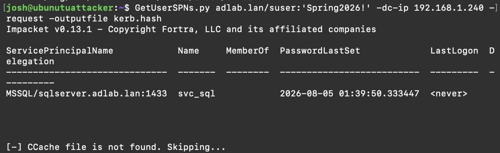

*`GetUserSPNs.py` requests the `svc_sql` service ticket, exposing its `$krb5tgs$` hash.*

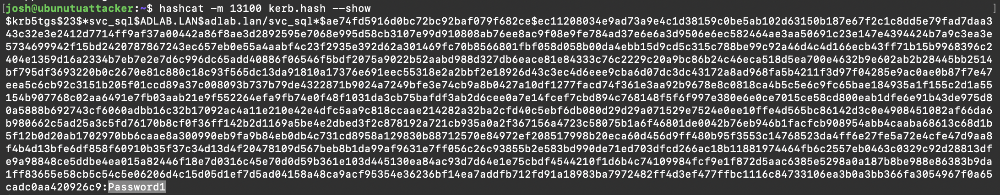

*hashcat cracks the ticket offline — the `svc_sql` password is recovered as `Password1`.*

### 4. AS-REP Roasting

Targeted an account with Kerberos pre-authentication disabled — this allows a hash to be requested with **no credentials at all**, only a valid username — then cracked it offline.

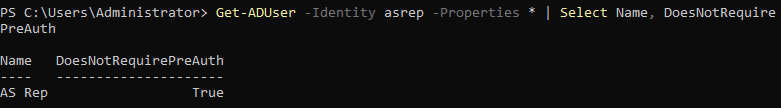

*The `asrep` account confirmed with Kerberos pre-authentication disabled (`DoesNotRequirePreAuth = True`).*

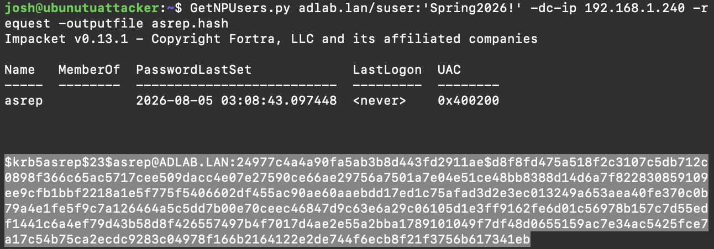

*`GetNPUsers.py` retrieves the `asrep` AS-REP hash — no target credentials required, only a username.*

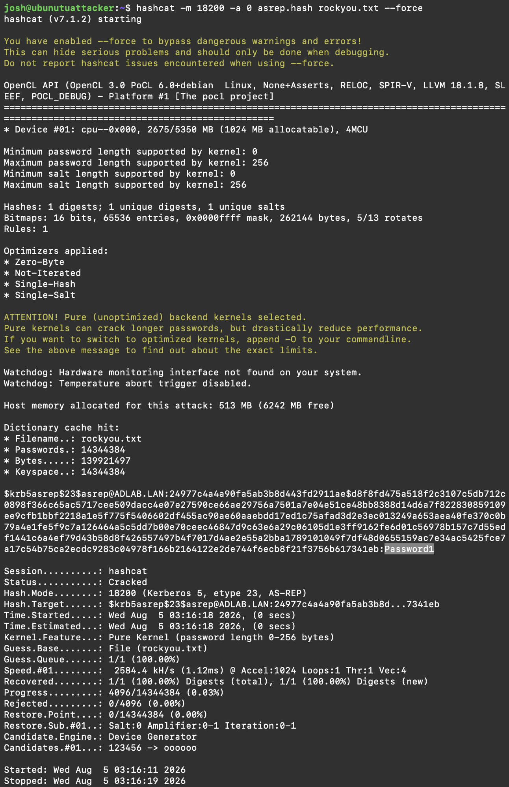

*hashcat cracks the AS-REP hash offline — password recovered as `Password1`.*

> **Note — the recovered password is intentionally the same as the Kerberoast target.** Both deliberately-vulnerable accounts (`svc_sql` and `asrep`) were assigned the weak password `Password1` to demonstrate password reuse. Because NTLM is unsalted, the two accounts share the *identical* NT hash (`64f12cddaa88057e06a81b54e73b949b`) — visible in the DCSync dump below. This is a deliberate teaching point, not a duplicated result.

### 5. Privilege Abuse & Lateral Movement

The cracked `svc_sql` account was a member of **Domain Admins** — a common real-world misconfiguration of over-privileged service accounts. Those credentials were used to gain remote code execution on the domain controller.

> Note: both `psexec` and the "fileless" `wmiexec` techniques were initially caught by Microsoft Defender on the DC — a useful blue-team observation. Defender was then disabled on the lab DC to study the attack mechanics.

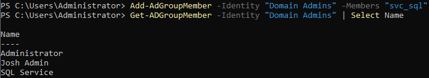

*`svc_sql` confirmed as a member of Domain Admins — the over-privileged service account misconfiguration.*

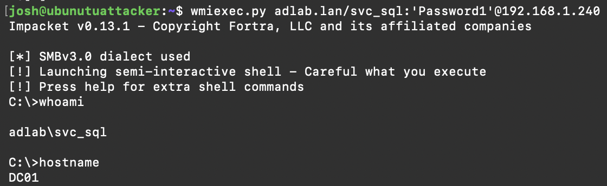

*`wmiexec.py` yields a remote shell on DC01 as `adlab\svc_sql`.*

### 6. Credential Dumping (DCSync)

With Domain Admin-level access, performed a DCSync attack to replicate the domain's password database (NTDS.dit) directly from the DC — dumping every account's NTLM hash, including `krbtgt` (the key to forging Golden Tickets) and the built-in Administrator.

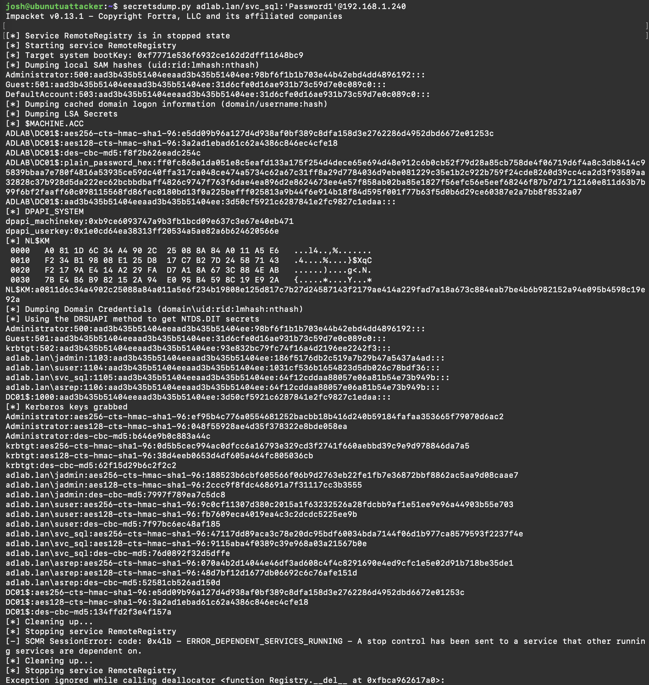

*`secretsdump.py` performs a DCSync, replicating every account's NTLM hash from the DC — including `krbtgt` and the built-in Administrator.*

### 7. Pass-the-Hash

Authenticated as the domain Administrator using only the stolen NTLM hash — no password, no cracking — proving that a captured hash alone is enough to fully own the domain.

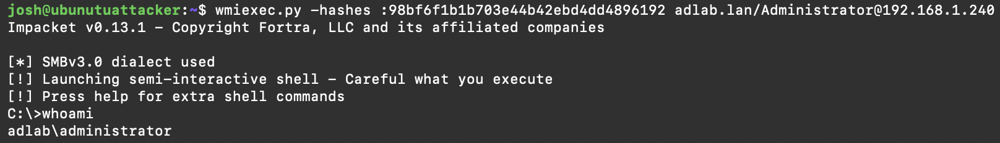

*`wmiexec.py -hashes` authenticates as `adlab\administrator` using only the stolen NTLM hash — no password, no cracking.*

### 8. Attack-Path Analysis with BloodHound

Ingested the domain into BloodHound Community Edition to visualize the privilege relationships that made the compromise possible — the direct path from the service account to Domain Admins, every account holding Domain Admin rights, and every principal capable of the DCSync attack.

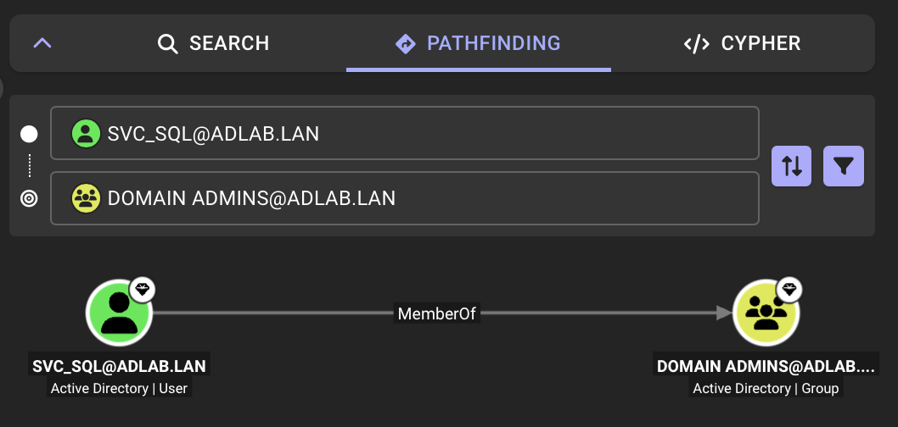

*BloodHound Pathfinding renders the direct edge: `SVC_SQL` --MemberOf--> `DOMAIN ADMINS`.*

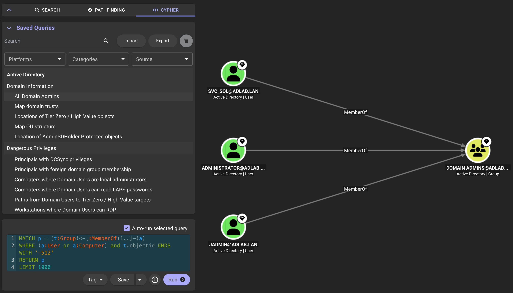

*All three accounts holding Domain Admin rights — including the service account that shouldn't.*

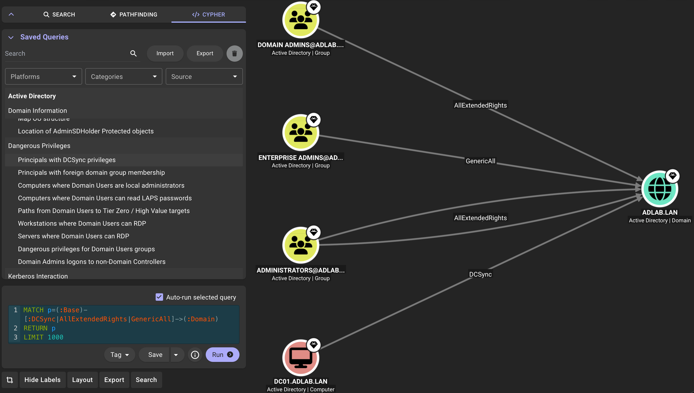

*Every principal able to perform DCSync against the domain — the privilege abused in step 6.*

---

## Results

- **Full domain compromise** achieved starting from an unauthenticated position on the local network
- **Two Kerberos roasting techniques** (Kerberoasting + AS-REP Roasting) both cracked in under 10 seconds against the rockyou wordlist
- **Complete NTDS.dit dump** via DCSync, exposing every domain hash including `krbtgt`
- **Domain Administrator access** obtained via Pass-the-Hash with no password cracking
- **Detection insight:** both remote-execution techniques were caught by Microsoft Defender before evasion — demonstrating the defensive value of endpoint monitoring

## Key Findings & Defensive Takeaways

| Finding | Risk | Remediation |
|---|---|---|
| Over-privileged service account (`svc_sql` in Domain Admins) | A single cracked service password = full domain compromise | Remove service accounts from privileged groups; apply tiered administration |
| Weak / reused passwords | `svc_sql` and `asrep` shared an identical NT hash — password reuse is trivially exploitable because NTLM is unsalted | Enforce long, unique passwords; use Group Managed Service Accounts (gMSA) |
| Kerberos pre-authentication disabled | Enables credential-free AS-REP Roasting | Require pre-authentication on all accounts |
| SPNs on weak-password accounts | Enables Kerberoasting | Strong passwords on all SPN-bearing accounts; monitor for anomalous TGS requests |

## Detection Opportunities

Every technique in this chain leaves evidence in Windows Security event logs. During the lab, Microsoft Defender independently flagged both the `psexec` and `wmiexec` execution attempts before evasion — a live confirmation that these attacks are observable. A defender monitoring the domain controller could detect this chain at multiple points:

| Attack | Primary detection signal |
|---|---|
| Kerberoasting | Event ID **4769** — a TGS service-ticket request, especially using RC4 encryption (`0x17`) against a user account with an SPN |
| AS-REP Roasting | Event ID **4768** — an AS-REQ for an account flagged "does not require pre-authentication" |
| Lateral movement (wmiexec) | Event ID **4624** (NTLM network logon, type 3) paired with **4688** process creation for the WMI-spawned `cmd.exe`; Defender alert on the execution attempt |
| DCSync | Event ID **4662** — directory-replication access (`DS-Replication-Get-Changes`) requested by a principal that is not a domain controller |
| Pass-the-Hash | Event ID **4624** (logon type 3, NTLM) and **4672** (special privileges) for the Administrator account from an unexpected source host |

The single highest-value defensive control across this whole chain is protecting and monitoring Tier Zero assets — a service account should never hold Domain Admin, and DCSync-equivalent rights (`4662`) from a non-DC should always alarm.

## Full Report

See [AD-Lab-Report.pdf](AD-Lab-Report.pdf) for the complete write-up — executive summary, full attack narrative with commands and evidence, findings with severity and remediation, MITRE ATT&CK mapping, and detection guidance.

## Using Claude as a Tool

This lab was built with AI assistance from [Claude](https://claude.ai) (Anthropic), used as a hands-on technical collaborator throughout. I directed the workflow and made every operational decision; Claude accelerated the setup and deepened my understanding of each technique. Specifically, Claude was used to:

- **Weigh architecture trade-offs** — deciding to split the lab across an ARM64 Mac (attacker) and an x86 laptop (domain controller) after evaluating cloud vs. local options against Apple Silicon's constraints on running Windows Server.
- **Troubleshoot infrastructure** — diagnosing a UTM boot/display failure with the Linux installer, ejecting a stuck install ISO, and correcting bridged-networking configuration so the attacker VM could reach the DC.
- **Generate and explain tooling** — producing the exact impacket, hashcat, and BloodHound CE syntax, and explaining *why* each step worked (e.g. the difference between hashcat modes 13100 and 18200, or why wmiexec is "fileless").
- **Interpret output** — reading Kerberos ticket hashes, `secretsdump` results, and Defender detections to decide the next move.
- **Produce documentation** — structuring this report and mapping the attack chain to MITRE ATT&CK.

I verified every command and result independently and ran all domain-controller-side actions myself. This reflects an AI-augmented security workflow — using AI to move faster and learn deeper while retaining ownership of the technical decisions.

## Tools & Assistance

- Windows Server 2022 (Active Directory Domain Services)
- Ubuntu Server 26.04 ARM64
- UTM (Apple Silicon virtualization) · Oracle VirtualBox
- impacket 0.13.1 (`GetUserSPNs`, `GetNPUsers`, `wmiexec`, `secretsdump`)
- hashcat · John the Ripper · rockyou wordlist
- BloodHound Community Edition
- Nmap
- AI assistance provided by [Claude](https://claude.ai) (Anthropic) during lab development and documentation.

## Other Labs in This Series

| Lab | Topic | Repo |
|---|---|---|
| Lab 1 | SOC/SIEM Detection | [soc-home-lab](https://github.com/jsmith-sec/soc-home-lab) |
| Lab 2 | Incident Response Simulation | [incident-response-lab](https://github.com/jsmith-sec/incident-response-lab) |
| Lab 3 | Web Application Attack | [web-app-attack-lab](https://github.com/jsmith-sec/web-app-attack-lab) |
| Lab 4 | Vulnerability Assessment | [vulnerability-assessment-lab](https://github.com/jsmith-sec/vulnerability-assessment-lab) |
| Lab 5 | Malware Analysis | [malware-analysis-lab](https://github.com/jsmith-sec/malware-analysis-lab) |
| Lab 6 | Phishing Analysis | [phishing-analysis-lab](https://github.com/jsmith-sec/phishing-analysis-lab) |
| Lab 7 | Active Directory Attack | This repo |

---

> **Disclaimer:** This lab was conducted in a fully isolated, self-owned environment for educational purposes. All techniques were performed against systems I built and control. Never test these techniques against systems you do not own or have explicit written authorization to assess.
